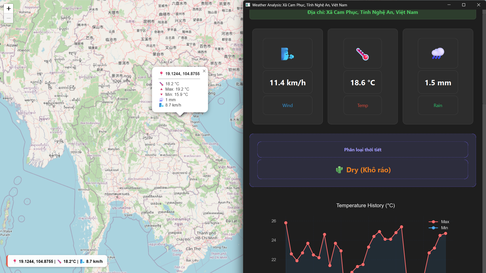

[![Contributors][contributors-shield]][contributors-url] [![Forks][forks-shield]][forks-url]

  <h1 align="center">Vietnam Weather Analysis Desktop App</h1>

  

    A modern desktop application for analyzing and visualizing Vietnam weather data
     
  

<!-- TABLE OF CONTENTS -->

  
Table of Contents

  <ol>
    <li>
      <a href="#about-the-project">About The Project</a>
      <ul>
        <li><a href="#built-with">Built With</a></li>
      </ul>
    </li>
    <li>
      <a href="#getting-started">Getting Started</a>
      <ul>
        <li><a href="#prerequisites">Prerequisites</a></li>
        <li><a href="#installation">Installation</a></li>
      </ul>
    </li>
    <li><a href="#contributors">Contributors</a></li>
  </ol>

## About The Project

This project is a **modern desktop application** built with **PyQt6** and an **interactive Leaflet.js map**, designed to analyze and visualize weather-related data across Vietnam.

The application allows users to interact with a Vietnam map, retrieve geographic coordinates, place markers, and serves as a foundation for further **data analysis and machine learning** on weather datasets.

(<a href="#readme-top">back to top</a>)

## Built With

- ![PyQt][pyqt-shield]
- ![Leaflet][leaflet-shield]
- ![Pandas][pandas-shield]
- ![NumPy][numpy-shield]
- ![Scikit-learn][sklearn-shield]
- ![Jupyter Notebook][Jupyternotebook-shield]

(<a href="#readme-top">back to top</a>)

## Getting Started

### Prerequisites

- ![Python][Python-shield] Python 3.8+
- ![Git][Git-shield] Git
- ![Jupyter Notebook][Jupyternotebook-shield] Jupyter Notebook (optional)

### Installation

**Step 1: Clone the repository**

    git clone https://github.com/thingdaguy/weather-analysis.git
    cd weather-analysis

**Step 2: Create a virtual environment**

    python -m venv venv

**Windows**

    .\venv\Scripts\activate

**macOS / Linux**

    source venv/bin/activate

**Step 3: Install dependencies**

    pip install -r requirements.txt

**Step 4: Run the system**

_Start Backend (ML Engine & API):_

    cd server
    python ml_api.py

_Start Desktop Client:_

    cd Client
    python main.py

(<a href="#readme-top">back to top</a>)

## Contributors

(<a href="#readme-top">back to top</a>)

<!-- MARKDOWN LINKS & SHIELDS -->
[contributors-shield]: https://img.shields.io/github/contributors/thingdaguy/weather-analysis.svg?style=for-the-badge
[contributors-url]: https://github.com/thingdaguy/weather-analysis/graphs/contributors
[forks-shield]: https://img.shields.io/github/forks/thingdaguy/weather-analysis.svg?style=for-the-badge
[forks-url]: https://github.com/thingdaguy/weather-analysis/network/members
[stars-shield]: https://img.shields.io/github/stars/thingdaguy/weather-analysis.svg?style=for-the-badge
[stars-url]: https://github.com/thingdaguy/weather-analysis/stargazers
[issues-shield]: https://img.shields.io/github/issues/thingdaguy/weather-analysis.svg?style=for-the-badge
[issues-url]: https://github.com/thingdaguy/weather-analysis/issues
[license-shield]: https://img.shields.io/github/license/thingdaguy/weather-analysis.svg?style=for-the-badge
[license-url]: https://github.com/thingdaguy/weather-analysis/blob/main/LICENSE

[python-shield]: https://img.shields.io/badge/Python-3776AB?style=for-the-badge&logo=python&logoColor=white
[pyqt-shield]: https://img.shields.io/badge/PyQt6-41CD52?style=for-the-badge&logo=qt&logoColor=white
[leaflet-shield]: https://img.shields.io/badge/Leaflet-199900?style=for-the-badge&logo=leaflet&logoColor=white
[pandas-shield]: https://img.shields.io/badge/Pandas-150458?style=for-the-badge&logo=pandas&logoColor=white
[numpy-shield]: https://img.shields.io/badge/NumPy-013243?style=for-the-badge&logo=numpy&logoColor=white
[Jupyternotebook-shield]: https://img.shields.io/badge/Jupyter-FF6600?style=for-the-badge&logo=jupyter&logoColor=black
[sklearn-shield]: https://img.shields.io/badge/Scikit--learn-F7931E?style=for-the-badge&logo=scikitlearn&logoColor=white
[rest-shield]: https://img.shields.io/badge/REST%20API-005571?style=for-the-badge
[git-shield]: https://img.shields.io/badge/Git-F05032?style=for-the-badge&logo=git&logoColor=white
